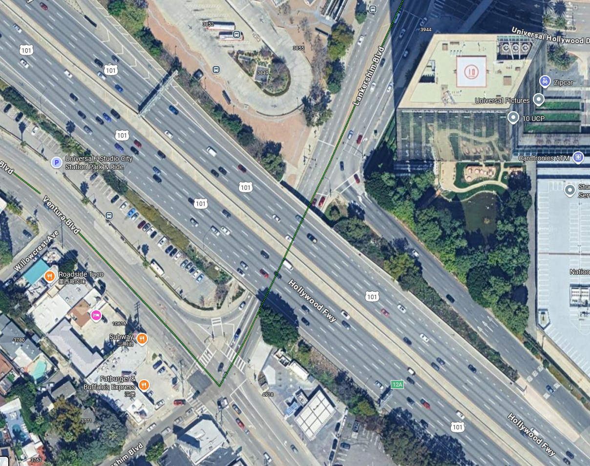
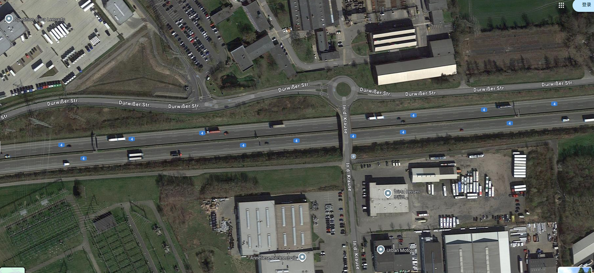

# Next-Generation Benchmark by Digital Twin（NBDT）
The NBDT provides the Digital Twin base map, formatted to support SUMO's road network requirements (e.g., .net.xml) and CARLA's visual and topological data (e.g., OpenDRIVE/.xodr), essential for trajectory dataset generation and co-simulation.

## Digital Twin Basemap For Trajactory Dataset

## Ubiquitous Traffic Eyes Dataset

[location Name   |    Real World Map |   Digital Twin Map   
:-------------------------:|:-------------------------:|:-------------------------:
[ Expressway 1(SQM1)   Expressway China  ](http://seutraffic.com/)    |      |     
[ Expressway 1(SQM2)   Expressway China  ](http://seutraffic.com/)    |      |     
[ Expressway 2(YTAvenue3)   Expressway China  ](http://seutraffic.com/)    |      |     
[ Expressway 3(CKQ4)  Expressway China  ](http://seutraffic.com/)    |      |     
[Expressway 4(RML7)  Expressway China  ](http://seutraffic.com/)    |      |     
[Urban Road 1(XAM-N5) Expressway China  ](http://seutraffic.com/)    |      |     
[Urban Road 1(XAM-N6)  Expressway China  ](http://seutraffic.com/)    |      |     
[Urban Road 2(PKDD8)  Expressway China  ](http://seutraffic.com/)    |      |     
[Urban Road 3(XAM-S9)  Expressway China  ](http://seutraffic.com/)    |      |     

## CitySim Dataset

Released by the University of Central Florida (UCF), CitySim provides vehicle trajectories extracted from drone aerial videos on urban roads, with a focus on safety and high-risk events. It supports traffic safety research and digital twin applications.

[location Name   |    Real World Map |   Digital Twin Map   
:-------------------------:|:-------------------------:|:-------------------------:
[ Intersection A  Intersection USA  ](https://github.com/UCF-SST-Lab/UCF-SST-CitySim1-Dataset)    |      |     
[ Intersection B  Intersection USA  ](https://github.com/UCF-SST-Lab/UCF-SST-CitySim1-Dataset)    |      |     
[ Intersection C  Intersection USA  ](https://github.com/UCF-SST-Lab/UCF-SST-CitySim1-Dataset)    |      |     
[ Intersection D  Intersection USA  ](https://github.com/UCF-SST-Lab/UCF-SST-CitySim1-Dataset)    |      |     
[ Intersection E  Intersection USA  ](https://github.com/UCF-SST-Lab/UCF-SST-CitySim1-Dataset)    |      |     
[ Intersection F  Intersection USA  ](https://github.com/UCF-SST-Lab/UCF-SST-CitySim1-Dataset)    |      |     
[ Roundabout A  Roundabout USA  ](https://github.com/UCF-SST-Lab/UCF-SST-CitySim1-Dataset)    |      |     
[ Roundabout B   Roundabout USA  ](https://github.com/UCF-SST-Lab/UCF-SST-CitySim1-Dataset)    |      |     
[ Expressway A  Expressway China  ](https://github.com/UCF-SST-Lab/UCF-SST-CitySim1-Dataset)    |      |     
[ Expressway B   Expressway China  ](https://github.com/UCF-SST-Lab/UCF-SST-CitySim1-Dataset)    |      |     
[ Freeway B   Freeway China  ](https://github.com/UCF-SST-Lab/UCF-SST-CitySim1-Dataset)    |      |     
[ Freeway C   Freeway China  ](https://github.com/UCF-SST-Lab/UCF-SST-CitySim1-Dataset)    |      |     
[ Freeway D   Freeway China  ](https://github.com/UCF-SST-Lab/UCF-SST-CitySim1-Dataset)    |      |  

## NGSIM Dataset

A classic public dataset released by the U.S. Department of Transportation. It contains high-precision vehicle trajectories from multiple road types and is widely used in traffic flow modeling and driver behavior research.

| Location Name | Real World Map | Digital Twin Map |
|:-------------------------:|:---------------------------------------------------------------------------------------------------------------------------------------:|:-------------------------:
| [ I-80 ](https://data.transportation.gov/stories/s/Next-Generation-Simulation-NGSIM-Open-Data/i5zb-xe34/)   | ** ** |  |
| [ US-101 ](https://data.transportation.gov/stories/s/Next-Generation-Simulation-NGSIM-Open-Data/i5zb-xe34/) | ** ** |  |
| [ Lankershim Boulevard ](https://data.transportation.gov/stories/s/Next-Generation-Simulation-NGSIM-Open-Data/i5zb-xe34/) | **** |  |
| [ Peachtree Street ](https://data.transportation.gov/stories/s/Next-Generation-Simulation-NGSIM-Open-Data/i5zb-xe34/) | ** ** |  |

## pNEUMA Dataset

A large-scale urban trajectory dataset collected in downtown Athens by a drone swarm during peak hours. Released by EPFL and collaborators, it emphasizes natural driving trajectories under congested and high-density traffic conditions.

location Name   |                Real World Map                 |   Digital Twin Map   
:-------------------------:|:---------------------------------------------:|:-------------------------:
[ platia  Omonias ](https://open-traffic.epfl.ch/)    | **** |     

## INTERACTION Dataset

A dataset focusing on interactive driving scenarios such as ramps, roundabouts, intersections, and signalized intersections. It provides high-quality maps and scene segmentation, and is widely used for interactive trajectory prediction research.

location Name   |                Real World Map                 |   Digital Twin Map   
:-------------------------:|:---------------------------------------------:|:-------------------------:

## Zen Traffic Data

Provided by Hanshin Expressway in Japan, this dataset offers long-term, wide-area vehicle trajectories along with related influencing factors. It is often used for expressway operation monitoring and incident analysis.

location Name   |                     Real World Map                     |   Digital Twin Map   
:-------------------------:|:------------------------------------------------------:|:-------------------------:
[ Hanshin  Expressway ](https://zen-traffic-data.net/english/)    | **** |     

## ROCO Dataset

A roundabout-specific dataset constructed for traffic conflict and incident studies. It uses roadside multi-camera recordings, trajectory extraction, and manual annotations of conflicts/collisions with severity labels.

location Name   |            Real World Map             |   Digital Twin Map   
:-------------------------:|:-------------------------------------:|:-------------------------:
[ Ann Arbor ](https://arxiv.org/abs/2405.10004)    | **** |     

## SIND

## SIND

A Drone Dataset at Signalized Intersection in China

## Dragon Lake Parking (DLP) Dataset

The Dragon Lake Parking (DLP) Dataset contains annotated video and data of vehicles, cyclists, and pedestrians inside a parking lot. We collected it by flying a drone above a huge parking lot. 

## I-24 MOTION

A large-scale traffic sensing platform deployed on a 4-mile section of I-24 in Tennessee, USA. It provides vehicle trajectories, multi-camera video, and sensor data for traffic management and autonomous driving research.

location Name   |               Real World Map               |   Digital Twin Map   
:-------------------------:|:------------------------------------------:|:-------------------------:
[ Nashville ](https://zen-traffic-data.net/english/)    | **** |     

## 100-Car Naturalistic Driving Study (NDS)
A landmark naturalistic driving study conducted by VTTI, NHTSA, and VDOT. It collected multi-channel in-vehicle video and vehicle dynamics sensor data, and compiled an “event database” (crash/near-crash/baseline). It remains a key resource for analyzing naturalistic driving behavior.

location Name   |                Real World Map                |   Digital Twin Map   
:-------------------------:|:--------------------------------------------:|:-------------------------:
[ Washington, D.C.  ](https://zen-traffic-data.net/english/)    | **** |     

## High-D Dataset

A highway vehicle trajectory dataset collected by RWTH Aachen (ika team) using drones on German highways. The trajectories are automatically extracted and designed for autonomous driving and microscopic traffic flow studies.

location Name   |             Real World Map              |   Digital Twin Map   
:-------------------------:|:---------------------------------------:|:-------------------------:
[ weisweiler ](https://levelxdata.com/highd-dataset/)    | **** |  
[ garzweiler ](https://levelxdata.com/highd-dataset/)    | **** |  
[ grevenbroich ](https://levelxdata.com/highd-dataset/)    | **** |  
[ bergheim-sud ](https://levelxdata.com/highd-dataset/)    | **** |  
[ serways raststatte ](https://levelxdata.com/highd-dataset/)    | **** |  
[ koln west ](https://levelxdata.com/highd-dataset/)    | **** |  

## in-D Dataset

Dataset Name   |           Real World Map            |   Digital Twin Map   
:-------------------------:|:-----------------------------------:|:-------------------------:
[ Bendplatz ](https://levelxdata.com/ind-dataset/)    | **** |  
[ Frankenburg ](https://levelxdata.com/ind-dataset/)    | **** |  
[ Heckstrasse ](https://levelxdata.com/ind-dataset/)    | **** |  
[ Neukollner Strasse ](https://levelxdata.com/ind-dataset/)    | **** |  

## round-D Dataset

Dataset Name   |    Real World Map |   Digital Twin Map   
:-------------------------:|:-------------------------:|:-------------------------:
[ Neuweiler ](https://levelxdata.com/round-dataset/)    | **** |  
[ KackertstraBe ](https://levelxdata.com/round-dataset/)    | **** |  
[ Thiergarten ](https://levelxdata.com/round-dataset/)    | **** |  

## Digital Twin Basemap For Autonomous Vehicle Test Field
Dataset Name   |    Real World Map |   Digital Twin Map   
:-------------------------:|:-------------------------:|:-------------------------:
[ Bejing YiZhuang  Region China ](https://github.com/ZhilingResearch/NBDT/main/asset/MainPage/bjyz.png)   |  ![] |  

## Special Digital Twin Basemap

## Smaller Digital Twin Basemap

## Features
Digital Twin Base Map      | Sumo Carla Co-Simulation           |  Croner Cases Testing
:-------------------------:|:-------------------------:|:-------------------------:
 |  | 
 **Human Factor Study**   | **Sensor Simulation** | **Autonomous Vehicle Simulation**    
 |  | 